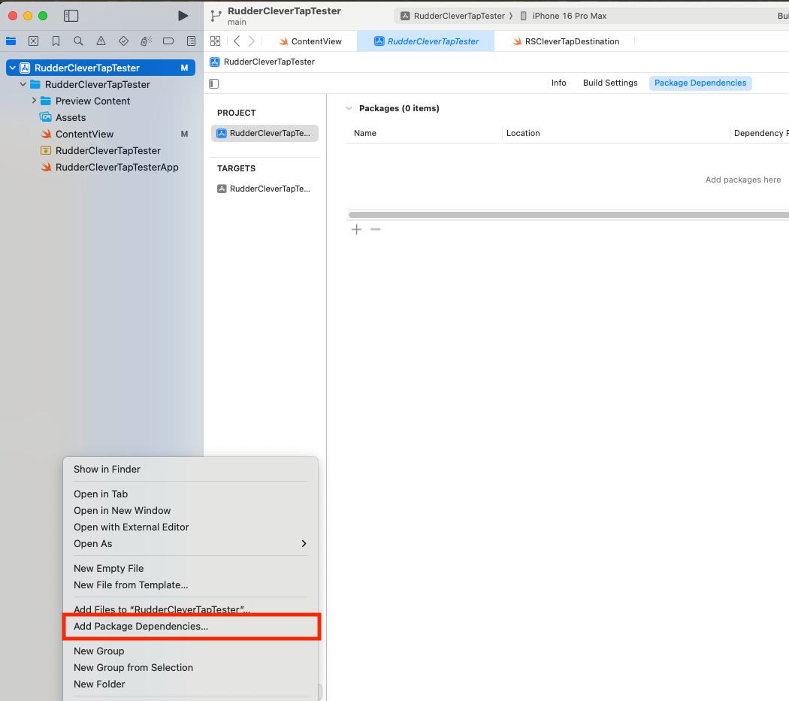
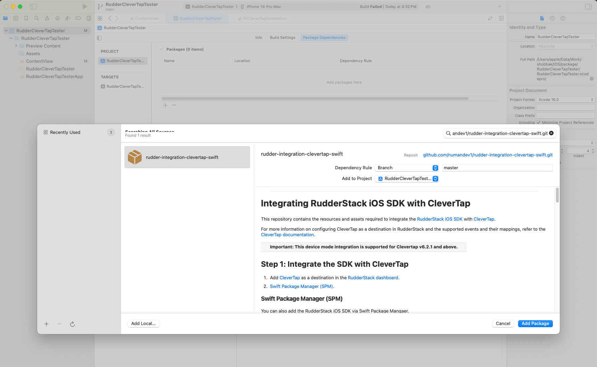

<p align="center">
  <a href="https://rudderstack.com/">
    
  </a>
</p>

<p align="center"><b>The Customer Data Platform for Developers</b></p>

<p align="center">
  <b>
    <a href="https://rudderstack.com">Website</a>
    ·
    <a href="https://www.rudderstack.com/docs/destinations/marketing/clevertap/">Documentation</a>
    ·
    <a href="https://rudderstack.com/join-rudderstack-slack-community">Community Slack</a>
  </b>
</p>

---
# Integrating RudderStack iOS SDK with CleverTap

This repository contains the resources and assets required to integrate the [RudderStack iOS SDK](https://www.rudderstack.com/docs/stream-sources/rudderstack-sdk-integration-guides/rudderstack-ios-sdk/ios-v2/) with [CleverTap](https://clevertap.com/).

For more information on configuring CleverTap as a destination in RudderStack and the supported events and their mappings, refer to the [CleverTap documentation](https://developer.clevertap.com/docs/ios).

| Important: This device mode integration is supported for Clevertap v6.2.1 and above.|
| :---|


## Step 1: Integrate the SDK with CleverTap

1. Add [CleverTap](https://clevertap.com/) as a destination in the [RudderStack dashboard](https://app.rudderstack.com/).
2. [Swift Package Manager (SPM)](https://www.swift.org/package-manager/). 


### Swift Package Manager (SPM)

You can also add the RudderStack iOS SDK via Swift Package Mangaer.

* Go to **File** -> **Add Package**, as shown:

 

* Enter the package repository (`https://github.com/numandev1/rudder-integration-clevertap-swift.git`) in the search bar.

*  In **Dependency Rule**, select **Exact Version** and enter latest as the value, as shown:



* Select the project to which you want to add the package.

* Finally, click on **Add Package**.


## Step 2: Import the SDK

### Swift

```swift
import RudderCleverTap
```

### Objective C

```objectivec
@import RudderCleverTap;
```

## Step 3: Initialize the RudderStack client (`RSClient`)

Place the following code in your `AppDelegate` file under the `didFinishLaunchingWithOptions` method:

### Swift

```swift
let config: RSConfig = RSConfig(writeKey: WRITE_KEY)
            .dataPlaneURL(DATA_PLANE_URL)
RSClient.sharedInstance().configure(with: config)
RSClient.sharedInstance().addDestination(RudderCleverTapDestination())
```
#### Usage
to understand the usage of Rudder Clevertap you can check the Example

## Step 4: Send events

Follow the steps listed in the [RudderStack iOS SDK](https://github.com/rudderlabs/rudder-sdk-ios/tree/master-v2#sending-events) repo to start sending events to CleverTap.

### Sending push notification events

To send your push notification events to CleverTap, follow these steps:

1. Place the following code in your `AppDelegate` file:

### Swift

```swift
func application(_ application: UIApplication, didRegisterForRemoteNotificationsWithDeviceToken deviceToken: Data) {
        RSClient.sharedInstance().application(application, didRegisterForRemoteNotificationsWithDeviceToken: deviceToken)
    }

func application(_ application: UIApplication, didReceiveRemoteNotification userInfo: [AnyHashable: Any], fetchCompletionHandler completionHandler: @escaping (UIBackgroundFetchResult) -> Void) {
    RSClient.sharedInstance().application(application, didReceiveRemoteNotification: userInfo, fetchCompletionHandler: completionHandler)
}
```


## About RudderStack

RudderStack is the **customer data platform** for developers. With RudderStack, you can build and deploy efficient pipelines that collect customer data from every app, website, and SaaS platform, then activate your data in your warehouse, business, and marketing tools.

| Start building a better, warehouse-first CDP that delivers complete, unified data to every part of your customer data stack. Sign up for [RudderStack Cloud](https://app.rudderstack.com/signup?type=freetrial) today. |
| :---|

## Contact us

For queries on configuring or using this integration, start a conversation in our [Slack](https://rudderstack.com/join-rudderstack-slack-community) community.

## Created By
[@numandev1](https://github.com/numandev1)
